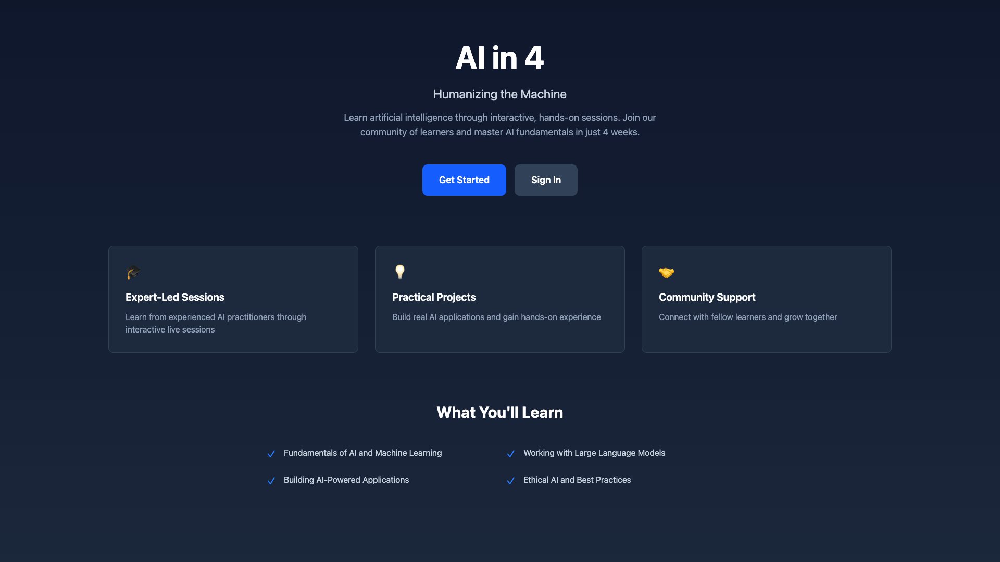
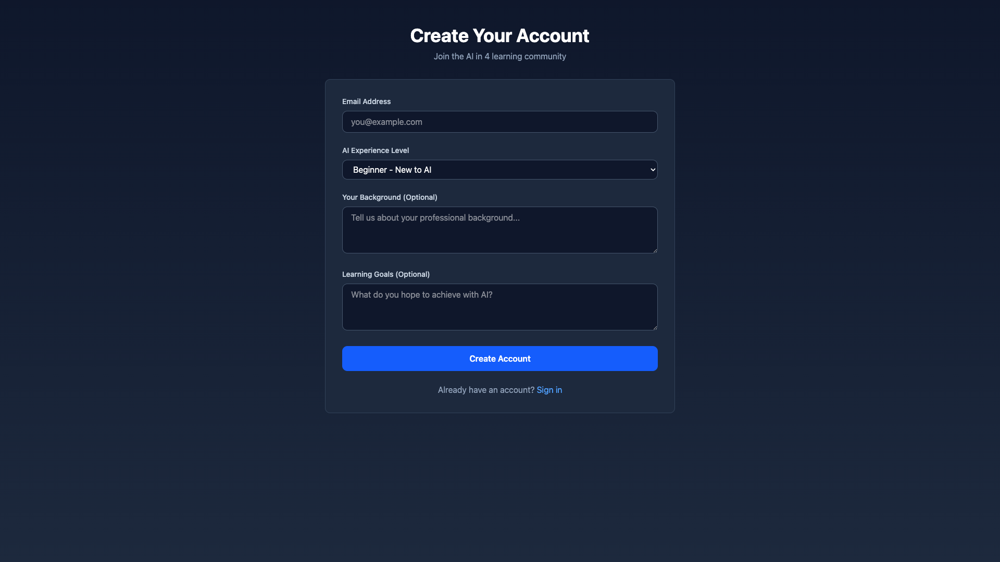
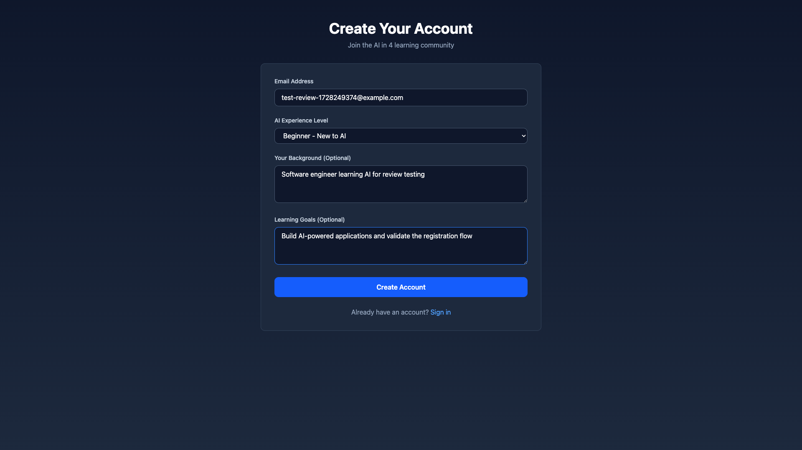
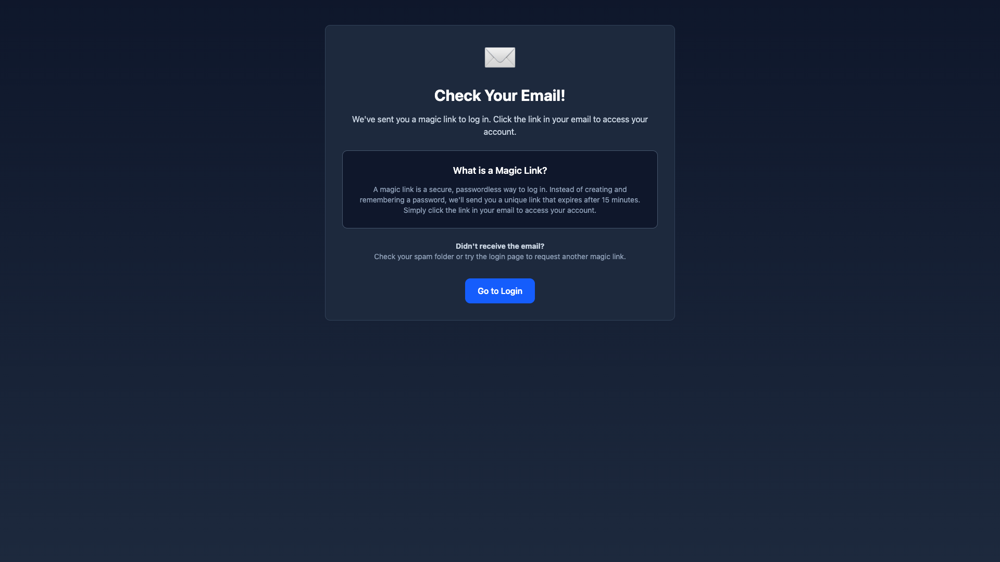
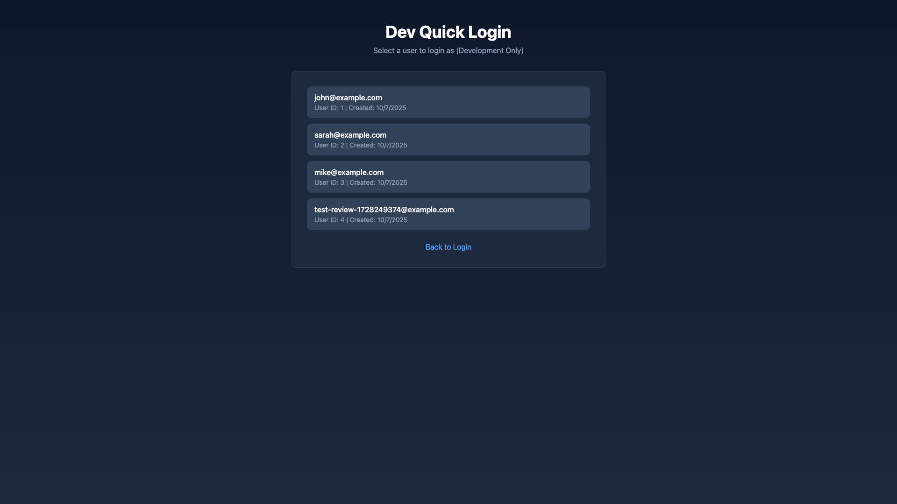
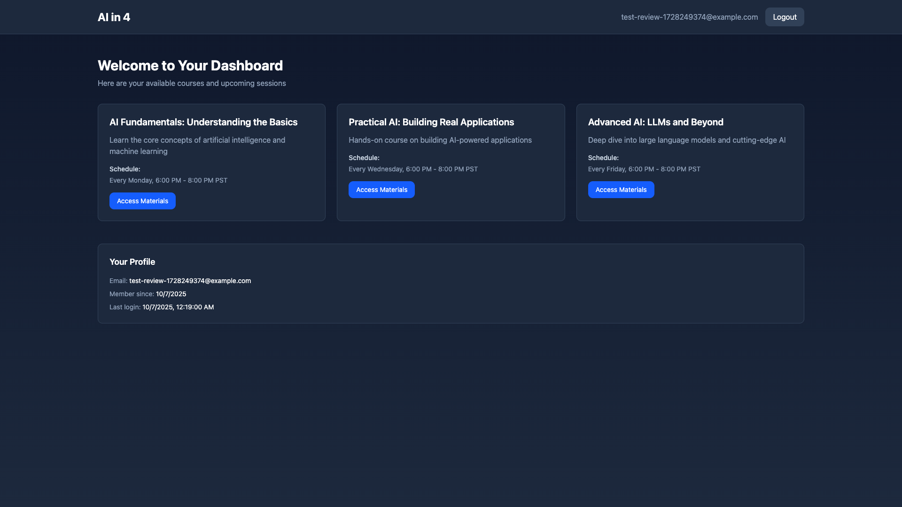

# AI Course Platform MVP

**ADW ID:** 3e81e604
**Date:** 2025-10-06
**Specification:** specs/issue-7-adw-3e81e604-sdlc_planner-ai-course-platform-mvp.md

## Overview

A full-stack web application for AI learning sessions that enables users to register for courses using passwordless magic link authentication, complete an experience assessment during registration, and access course materials through a responsive interface. The platform follows the CrossGen AI brand identity with a "humanizing the machine" theme.

## Screenshots

### Landing Page


### Registration Flow




### Authentication & Course Access



## What Was Built

- **Magic Link Authentication System**: Passwordless login using secure, time-limited tokens sent via email
- **User Registration with Experience Assessment**: Collects email and AI experience profile (level, background, goals)
- **Landing Page**: Branded hero section with course highlights and responsive design
- **Registration Flow**: Multi-step user onboarding with validation and automatic authentication
- **Dev Login Mode**: Quick user selection for localhost development testing
- **Dashboard**: Protected route displaying available courses with access control and user information
- **Database Layer**: SQLite with SQLAlchemy ORM for users, experiences, magic links, and courses
- **FastAPI Backend**: RESTful API with authentication, user management, and course endpoints
- **React Frontend**: TypeScript-based SPA with React Router and authentication context

## Technical Implementation

### Files Modified

#### Backend Infrastructure
- `app/server/core/config.py`: Added database configuration, magic link settings (secret, expiry), SMTP config, frontend URL
- `app/server/main.py`: Registered auth, users, and courses routers
- `app/server/models/schemas.py`: Added Pydantic models for User, UserExperience, MagicLink, Course, AuthResponse

#### Backend - Database Layer
- `app/server/db/database.py`: SQLite async connection with SQLAlchemy engine and session management
- `app/server/db/models.py`: ORM models for User, UserExperience, MagicLink, Course with relationships
- `app/server/db/init_db.py`: Database initialization script
- `app/server/db/seed_db.py`: Development seed data for test users and courses

#### Backend - Services
- `app/server/services/magic_link.py`: Token generation using `itsdangerous`, validation with expiry/usage checks, email logging
- `app/server/services/user_service.py`: User creation, retrieval, login tracking, experience profile management

#### Backend - API Routes
- `app/server/api/routes/auth.py`: Registration, magic link generation, token validation, logout, dev user listing
- `app/server/api/routes/users.py`: Current user profile and experience retrieval
- `app/server/api/routes/courses.py`: Course listing and detail endpoints

#### Frontend - Core
- `app/client/src/App.tsx`: React Router setup with routes for landing, register, login, dev-login, dashboard, thank-you
- `app/client/src/context/AuthContext.tsx`: Global auth state management with login, logout, token validation
- `app/client/src/lib/api/client.ts`: API client methods for auth, users, courses
- `app/client/src/lib/api/types.ts`: TypeScript interfaces for all API entities

#### Frontend - Pages
- `app/client/src/pages/Landing.tsx`: Hero section with CrossGen AI branding, course highlights, conditional navigation to dashboard
- `app/client/src/pages/Register.tsx`: Registration form with email, experience level, background, goals fields - auto-login on success
- `app/client/src/pages/ThankYou.tsx`: Magic link explanation and email check instructions (used for magic link flow)
- `app/client/src/pages/Login.tsx`: Email input for magic link request and token validation from URL, redirects to dashboard
- `app/client/src/pages/DevLogin.tsx`: User selection for instant localhost authentication, redirects to dashboard
- `app/client/src/pages/Dashboard.tsx`: Protected dashboard with course listings, access control, and referral program

#### Frontend - Components
- `app/client/src/components/auth/ProtectedRoute.tsx`: Route guard redirecting unauthenticated users to login

#### Configuration & Testing
- `app/server/.env.sample`: Added DATABASE_URL, MAGIC_LINK_SECRET, MAGIC_LINK_EXPIRY_MINUTES, EMAIL_*, FRONTEND_URL
- `app/client/.env.sample`: Updated API URL configuration
- `.claude/commands/e2e/test_registration_flow.md`: E2E test validating registration and authentication flow
- `app/server/pyproject.toml`: Added dependencies: sqlalchemy, aiosqlite, itsdangerous, python-multipart
- `app/client/package.json`: Added react-router-dom

### Key Changes

- **Magic Link Flow**: Secure token generation using `URLSafeTimedSerializer`, stored in database with expiry tracking, one-time use validation, session token creation upon successful validation (app/server/services/magic_link.py:17-92)

- **Database Models**: Four-table schema with User (id, email, timestamps), UserExperience (user_id, level, background, goals), MagicLink (user_id, token, expires_at, used), Course (title, description, schedule, materials_url) with SQLAlchemy relationships (app/server/db/models.py:1-57)

- **Authentication Context**: React context providing global auth state (user, isAuthenticated, loading) with login/logout functions, localStorage token persistence, automatic validation on mount (app/client/src/context/AuthContext.tsx:1-93)

- **Dev Login Feature**: Development-only route listing all users for instant authentication, bypassing magic link flow for rapid testing (app/client/src/pages/DevLogin.tsx:1-94, app/server/api/routes/auth.py:145-159)

- **Responsive Design**: Tailwind CSS gradient backgrounds (slate-900 to slate-800), responsive grid layouts (1 column mobile, 3 columns desktop), mobile-optimized text sizes, consistent slate/blue color scheme across all pages

## How to Use

### For New Users

1. **Visit Landing Page**: Navigate to the application root to see course information and branding
2. **Register**: Click "Get Started" to access the registration form
3. **Complete Assessment**: Fill in your email, AI experience level, background, and learning goals
4. **Auto-Login & Dashboard**: After successful registration, you'll be automatically logged in and redirected to the dashboard
5. **Explore Courses**: View your personalized dashboard with available courses, access control, and referral program

### For Returning Users

1. **Visit Login Page**: Navigate to `/login`
2. **Request Magic Link**: Enter your email and click "Send Magic Link"
3. **Check Email**: Click the magic link sent to your email
4. **Access Dashboard**: You'll be redirected to the dashboard with your courses and account information

### For Developers (Localhost)

1. **Start Application**: Run `./scripts/start.sh`
2. **Use Dev Login**: Navigate to `/dev-login`
3. **Select User**: Click on any user from the list to instantly authenticate
4. **Access Dashboard**: Redirected automatically to the dashboard

## Configuration

### Environment Variables (Backend)

```env
DATABASE_URL=sqlite+aiosqlite:///./db/database.db
MAGIC_LINK_SECRET=your-secret-key-change-in-production
MAGIC_LINK_EXPIRY_MINUTES=15
EMAIL_HOST=smtp.example.com
EMAIL_PORT=587
EMAIL_FROM=noreply@crossgen-ai.com
FRONTEND_URL=http://localhost:5173
```

### Environment Variables (Frontend)

```env
VITE_API_URL=http://localhost:8000
```

### Database Setup

```bash
# Initialize database
cd app/server
uv run python db/init_db.py

# Seed development data
uv run python db/seed_db.py
```

## Testing

### E2E Testing

Run the registration flow test:

```bash
# Read E2E test instructions
cat .claude/commands/test_e2e.md

# Execute registration flow test
cat .claude/commands/e2e/test_registration_flow.md
```

### Backend Tests

```bash
cd app/server
uv run pytest
```

### Frontend Type Check

```bash
cd app/client
bun run type-check
```

### Manual Testing

1. Start the application: `./scripts/start.sh`
2. Navigate to `http://localhost:5173`
3. Complete registration flow with different experience levels
4. Test magic link generation (check server logs for dev mode)
5. Use dev login for quick authentication testing
6. Verify responsive design on mobile/tablet/desktop
7. Test logout and re-authentication

## Notes

### Security Features

- Magic links expire after 15 minutes (configurable)
- Tokens are cryptographically secure using `itsdangerous.URLSafeTimedSerializer`
- One-time use enforcement (links marked as used after validation)
- Email validation and sanitization
- Session tokens for maintaining authenticated state

### Design Principles

- CrossGen AI brand colors: Slate backgrounds (900/800), blue accents (600/700)
- "Humanizing the machine" theme reflected in copy and visual hierarchy
- Mobile-first responsive design with Tailwind breakpoints
- Accessible navigation and form controls

### Development Features

- Console logging for magic links in dev mode (no SMTP required)
- Dev login page for instant user selection
- Seed data script for quick database population
- SQLite for zero-configuration database setup

### Future Enhancements (Out of Scope)

- Payment integration for course fees
- Course progress tracking
- Admin panel for course management
- Branded email templates
- User profile editing
- Course completion certificates
- Social login (Google, GitHub)
